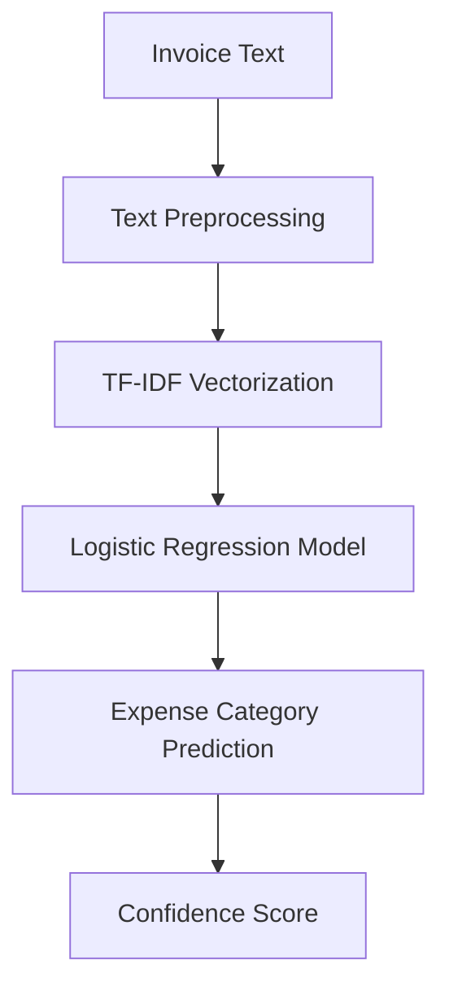

# 💸 Invoice Expense Classifier AI

<div align="center">

# AI-Powered Invoice & Expense Classification System

Automatically classify invoice descriptions into business expense categories using Machine Learning and NLP.


</div>

---

# 📌 Overview

Invoice Expense Classifier AI is a production-ready Machine Learning API that automatically predicts expense categories from invoice text descriptions.

The system uses:
- Natural Language Processing (NLP)
- TF-IDF Vectorization
- Logistic Regression
- FastAPI REST API

This project helps businesses automate financial workflows and reduce manual expense categorization efforts.

---

# 🚀 Features

## ✅ Core Features

- AI-powered invoice classification
- FastAPI REST API
- Confidence score prediction
- TF-IDF text vectorization
- Logistic Regression classifier
- Real-time predictions
- JSON API responses

---

## ⚡ Production Features

- Docker support
- Clean architecture
- Modular codebase
- Swagger API documentation
- Training pipeline included
- Unit testing support
- Lightweight deployment
- Scalable backend design

---

# 🧠 Supported Categories

The model predicts the following expense categories:

- Logistics
- Office Supplies
- Cloud/Software
- Utilities
- Travel
- Inventory

---

# Live Demo link: https://invoice-expense-classifier.onrender.com/docs
---

# 🧠 Machine Learning Workflow



---

# 📂 Project Structure

```bash
Invoice-Expense-Classifier/
│
├── app/
│   ├── main.py
│   ├── model.py
│   ├── preprocessing.py
│   ├── schemas.py
│   └── utils.py
│
├── data/
│   └── train.csv
│
├── models/
│   ├── model.pkl
│   └── vectorizer.pkl
│
├── tests/
│   └── test_api.py
│
├── train.py
├── requirements.txt
├── Dockerfile
├── README.md
└── .gitignore
```

---

# ⚙️ Installation & Setup

## 1️⃣ Clone Repository

```bash
git clone https://github.com/Bhavana998/Invoice-Expense-Classifier.git

cd Invoice-Expense-Classifier
```

---

## 2️⃣ Create Virtual Environment

### Windows

```bash
python -m venv venv

venv\Scripts\activate
```

### Linux / Mac

```bash
python3 -m venv venv

source venv/bin/activate
```

---

## 3️⃣ Install Dependencies

```bash
pip install -r requirements.txt
```

---

# 🏋️ Train Machine Learning Model

Run the training pipeline:

```bash
python train.py
```

Generated model files:

```bash
models/model.pkl
models/vectorizer.pkl
```

---

# 🚀 Run FastAPI Server

```bash
uvicorn app.main:app --reload
```

Server URL:

```bash
http://127.0.0.1:8000
```

Swagger API Documentation:

```bash
http://127.0.0.1:8000/docs
```

---

# 📊 Sample Training Dataset

## `data/train.csv`

```csv
text,category
AWS monthly hosting charges,Cloud/Software
Blue Dart courier delivery,Logistics
Printer paper purchase,Office Supplies
Electricity bill payment,Utilities
Flight booking for meeting,Travel
Warehouse inventory materials,Inventory
```

---

# 🔌 API Usage

# POST `/predict`

Predict expense category from invoice text.

---

## 📥 Request
# 📌 Sample API Requests

## Example 1 — Cloud/Software

### Request

```json
{
  "text": "AWS monthly cloud hosting bill"
}
```

### Response

```json
{
  "category": "Cloud/Software",
  "confidence": 0.97
}
```

---

## Example 2 — Logistics

### Request

```json
{
  "text": "DHL express courier for warehouse delivery"
}
```

### Response

```json
{
  "category": "Logistics",
  "confidence": 0.95
}
```

---

## Example 3 — Office Supplies

### Request

```json
{
  "text": "Staples printer paper ream 500 sheets"
}
```

### Response

```json
{
  "category": "Office Supplies",
  "confidence": 0.94
}
```

---

## Example 4 — Utilities

### Request

```json
{
  "text": "Electricity bill for March with demand charges"
}
```

### Response

```json
{
  "category": "Utilities",
  "confidence": 0.96
}
```

---

## Example 5 — Travel

### Request

```json
{
  "text": "Delta flight ticket JFK to LAX for business conference"
}
```

### Response

```json
{
  "category": "Travel",
  "confidence": 0.93
}
```


---

# 🧪 API Testing Examples

## cURL Example

```bash
curl -X POST "http://127.0.0.1:8000/predict" \
-H "Content-Type: application/json" \
-d "{\"text\":\"Blue Dart courier charges\"}"
```

---

## Python Request Example

```python
import requests

url = "http://127.0.0.1:8000/predict"

payload = {
    "text": "Electricity bill for warehouse"
}

response = requests.post(url, json=payload)

print(response.json())
```

---

# 🐳 Docker Deployment

## Build Docker Image

```bash
docker build -t invoice-classifier .
```

---

## Run Docker Container

```bash
docker run -p 8000:8000 invoice-classifier
```

---

# 🧪 Running Tests

```bash
pytest
```

---

# 📈 Model Details

| Component | Technology |
|---|---|
| NLP Technique | TF-IDF |
| ML Algorithm | Logistic Regression |
| Backend Framework | FastAPI |
| Serialization | Pickle |
| Testing Framework | Pytest |

---

# 🌍 Deployment Options

The project can be deployed on:

- Render
- Railway
- Docker
- AWS EC2
- Azure
- Google Cloud Platform
- Kubernetes

---

# 👩‍💻 Author

## setty Bhavana

### GitHub Profile

https://github.com/Bhavana998

### Repository

https://github.com/Bhavana998/Invoice-Expense-Classifier

---

# ⭐ Support

If you found this project useful:

- ⭐ Star the repository
- 🍴 Fork the project
- 🚀 Contribute improvements

---

# 📜 License

This project is licensed under the MIT License.

---

<div align="center">

## 🚀 Built with FastAPI + Machine Learning + NLP

</div>
